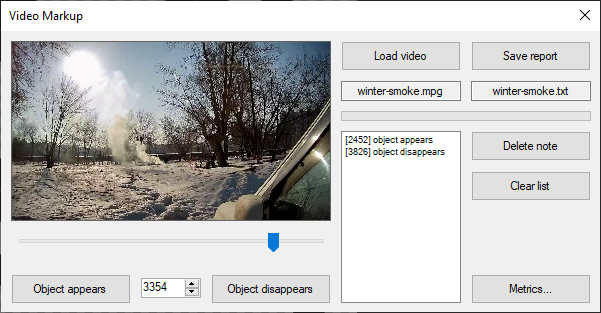
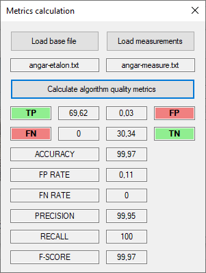

# Video markup program:
- download video and automatically split it into frames;
- you can mark events of showings and site visits;
- saving the report in JSON format;
- compare the reference markup and the data obtained as a result of your research.

# Main form:

# Metrics form:

 
